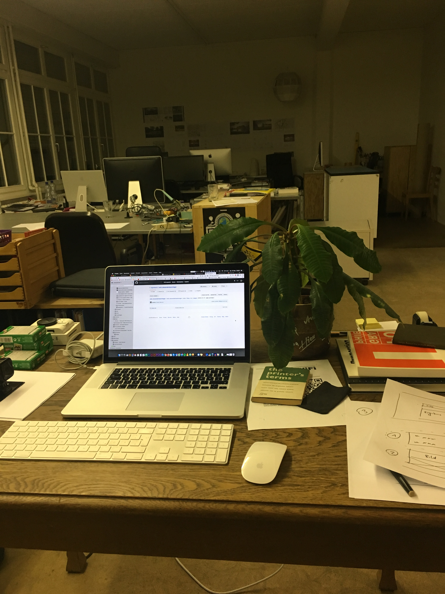

## Jetzt geht's los
Alex ist heute in Zürich angekommen. Das Auto haben wir noch nicht so richtig parkieren können, aber da finden wir bestimmt noch was. Aber seine Pflanze und sein Arbeitsplatz ist parat. Montags geht es los #spuckpalme

### First things first
Dinge die Zuerst interessieren?

## Work
* Welche Arbeiten machen wir zusammen?
* Wie ist die Gegenleistung/Kompensation?
* WiFi und Strom → Internationale Stecker?
* Schlüssel Arbeitsplatz

## Live
* Fahrrad → wie bewege ich mich in der Stadt?
* WiFi@Home
* Schlüssel für Zuhause
* Ansprechpartner
* Wo gibts einen Supermarkt
* Wo gibts eine Prepaid-SIM
