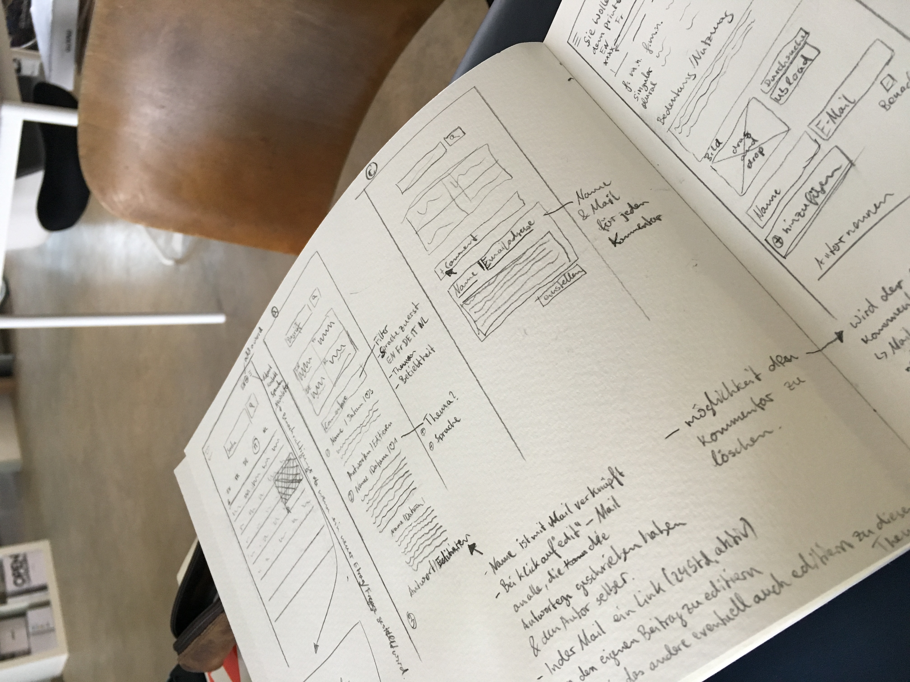
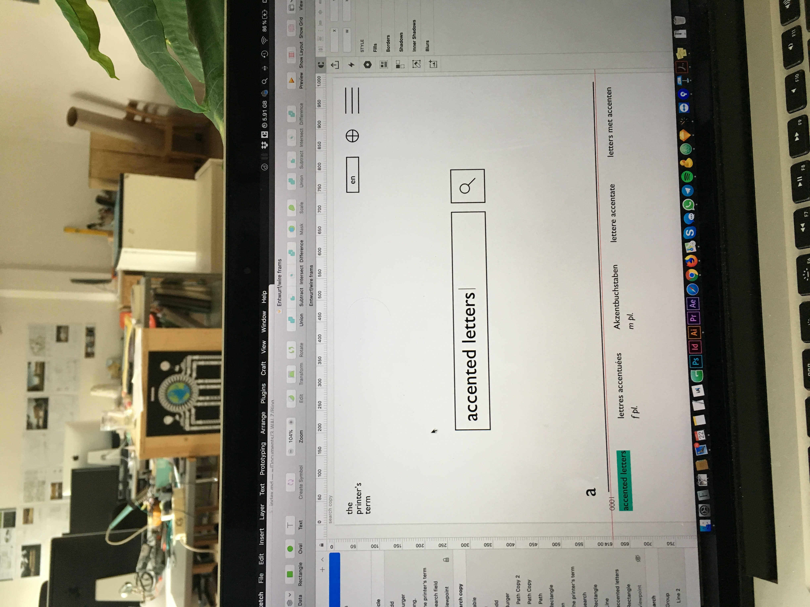

## Der Blick von außen.
Stefan arbeitet schon einige Zeit an der Idee, das antiquarische Buch "the printer's terms" von Rudolf Hostettler zu digitalisieren.   
Heute haben wir meine skizzierten Überlegungen der letzten Tage besprochen und auf Umsetzbarkeit und Sinnhaftigkeit überprüft.

