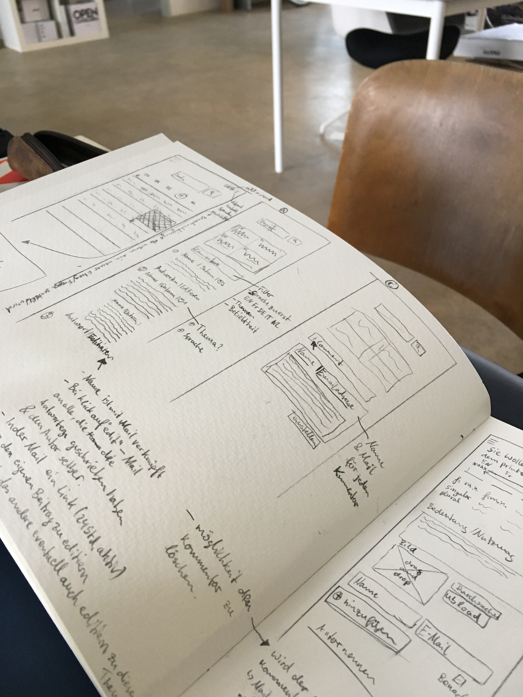
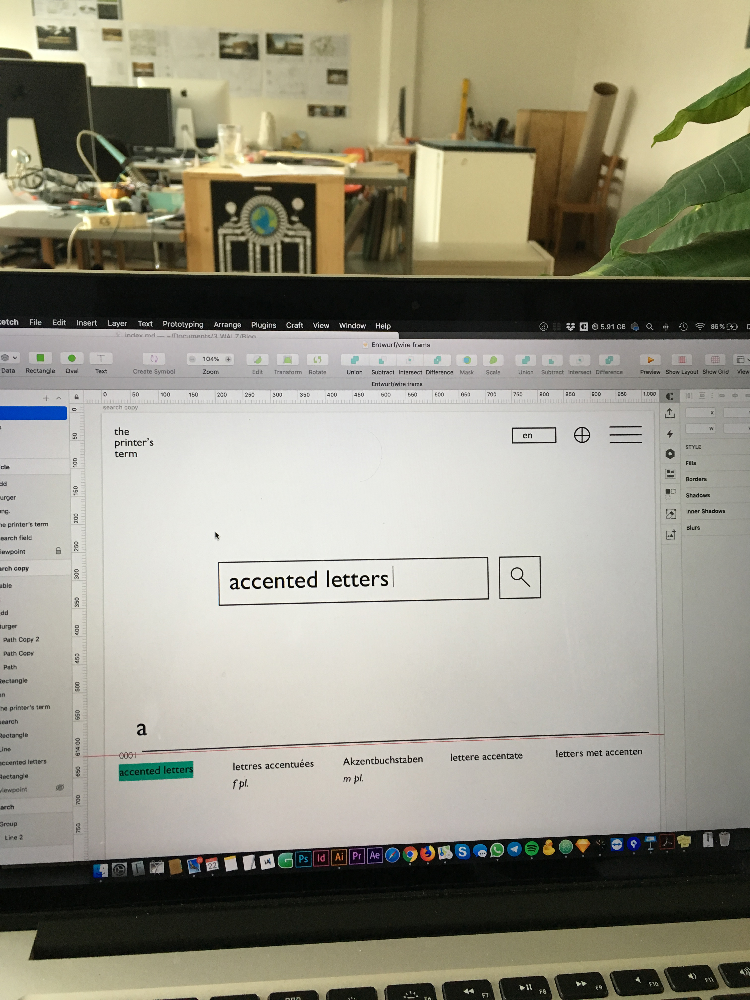

## Der Blick von außen.
Stefan arbeitet schon einige Zeit an der Idee, das nur noch antiquarisch erhältliche Buch "the printer's terms" von Rudolf Hostettler zu digitalisieren.   
Heute haben wir die skizzierten Überlegungen von Alex der letzten Tage besprochen und auf Umsetzbarkeit und Sinnhaftigkeit angeschaut.

## Zum Buch
In den Jahren 1949 – 1969 (diverse Auflagen) ist im Verlag Zollikofer in St. Gallen ein fünf-sprachiges Fachwörter-Lexikon über berufsspezifische Begriffe der Druckindustrie erschienen. Rudolf Hostettler – der vormalige Redaktor der [«Typografischen Monatsblätter»](http://www.tm-research-archive.ch/) – hat in langjähriger akribischer Arbeit die Begriffe zusammengetragen und eine Sammlung geschaffen, die auch einer neuen Generation zugänglich sein sollte.
