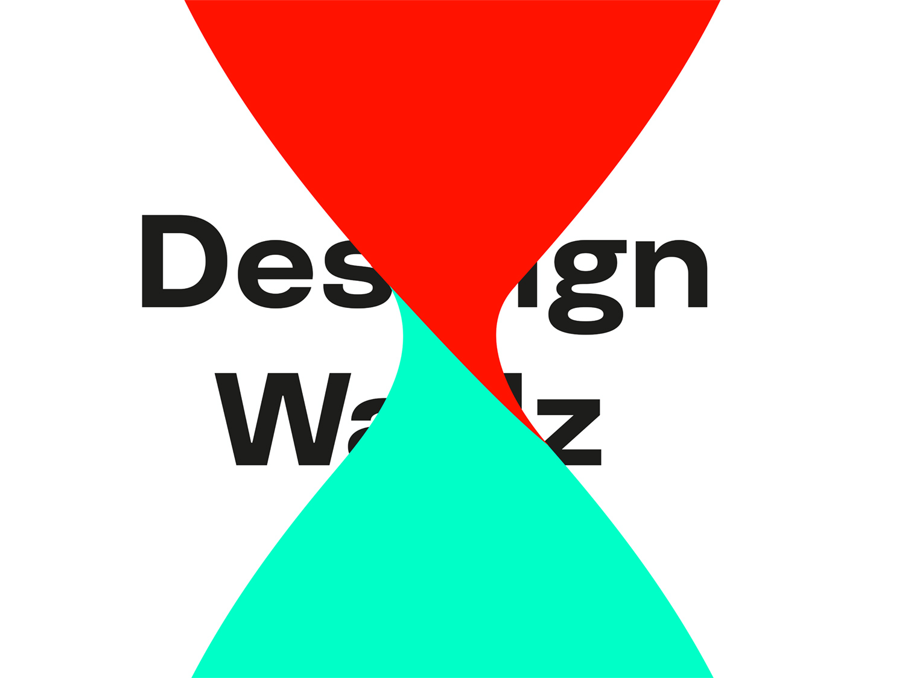
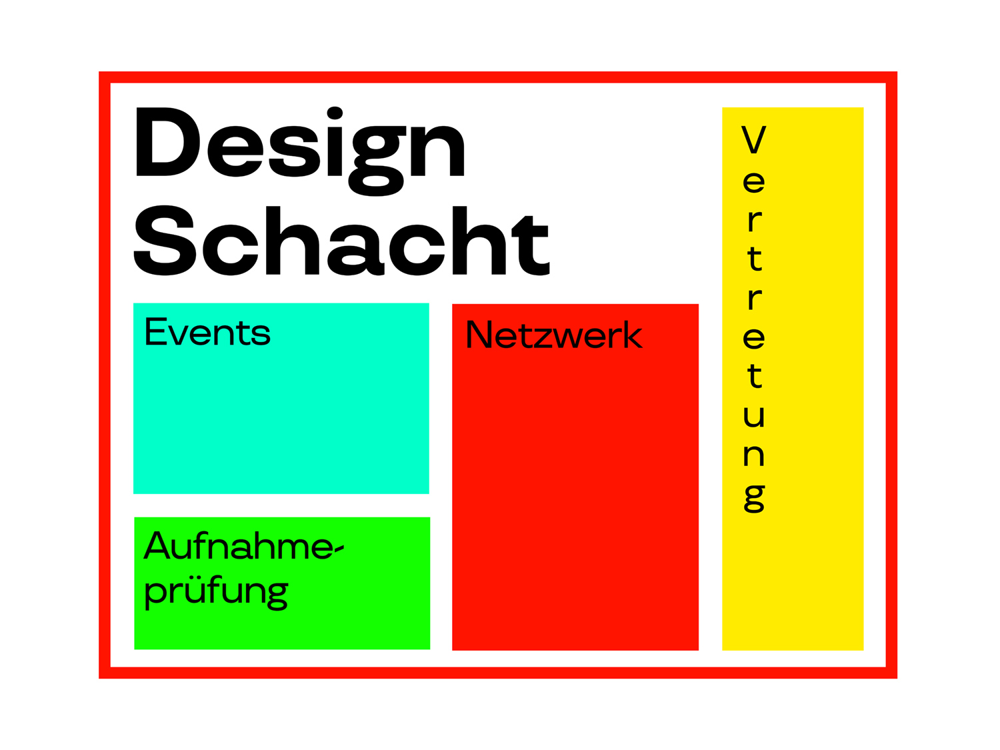

## Interaction Design und Walz?
Genau so ungewöhnlich wie für ein Grafiker im 21. Jahrhundert ist es für Interaction Designern auf eine Walz zu gehen. Dennoch hat Stefan im Modul «OpenSource and Communities» bei der höheren Fachschule Interaction Design einen Platz für Alex eingeplant und heute hat nun also der in Zürich haltende Wandergeselle zur Klasse gesprochen.

ALEX: Bitte hier Titelseite einfügen

Die grafisch liebevoll gestlatete Präsentation wurde von den Studierenden später sehr lobend erwähnt.

ALEX: Bitte hier ein Bild aus dem geschichtlichen Teil einfügen.

Nebst einer kurzen Präsentation der bisherigen Arbeitsstationen von Alex war die Präsentation auch mit geschichtlichen Infos zur Walz ausgebaut.

ALEX: Bitte hier ein Bild aus dem Zukunft-Thensen-Teil einfügen

Und auch ein Blick nach Vorne wurde nicht vergessen!
