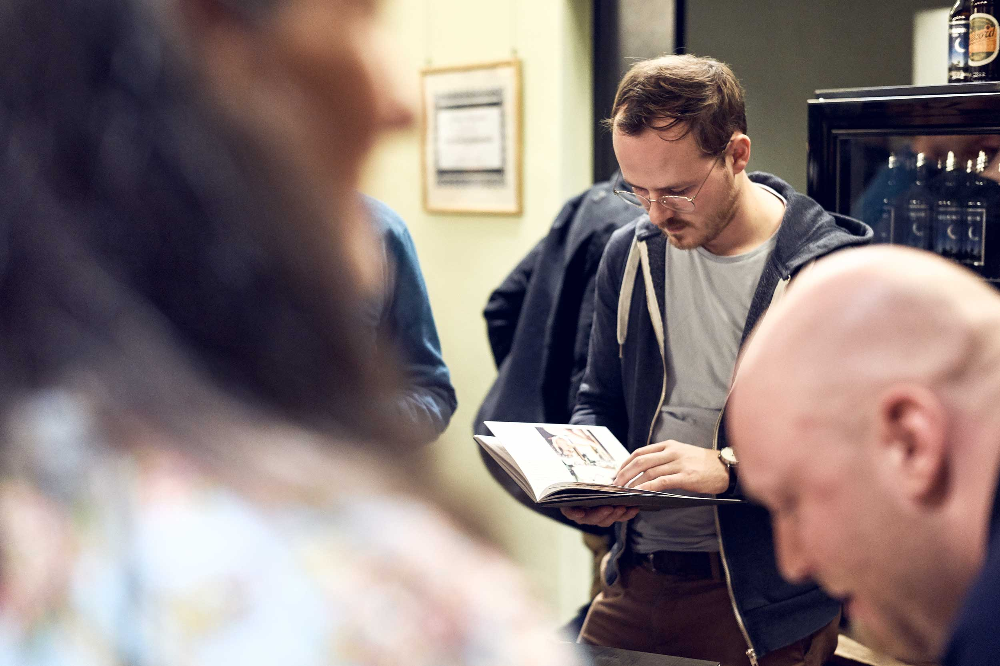
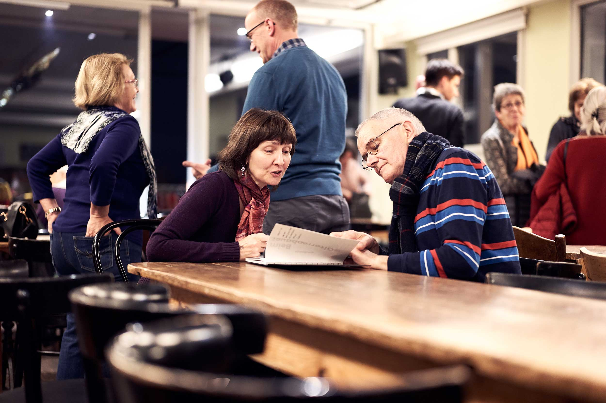

import Gallery from 'gatsby-theme-signalwerk/src/components/Gallery';

## Gitarrenbauer Ermanno Chiavi
Nicht nur die Arbeit, sondern auch die Muse soll in Zürich gestärkt werden und so sind wir heute in die riesige Atelier-Gemeinschaft an der [Hermetschloostrasse 70](http://gleis70.ch/) gefahren. Zuerst hat uns [Ermanno Chiavi](http://www.chiaviguitars.com/) in seiner Werkstatt einen Einblick in seine Arbeit als Gitarrenbauer gegeben. Er hat uns gezeigt, wie er in liebevoller Handarbeit in über 100 Stunden arbeit eine Gitarre zum klingen bringt. Erstaundlich fand ich auch, dass trotz dem Handwerk er modernste akustische Instrumente hat, die ihm helfen auf der Suche nach dem «richtigen Klang» eine Ohr-Breite näher dran zu sein.

## Konzert von Jure Cerkovnik
Danach gings in die Dachkantine. Dort wurde uns in einem Konzert vom slovenischen Gitarrist [Jure Cerkovnik](http://jurecerkovnik.com/) gezeigt, was aus der liebevollen Arbeit von Ermanno durch den Musiker entstehen kann. Im «Werkstattkonzert» lauschten viele Leute, die für den jungen Musiker extra angereist sind.

<Gallery>

</Gallery>

Die Fotos wurden uns freundlicherweise von [Ueli Steingruber](http://www.uelisteingruber.ch/) zur Verfügung gestellt. Danke!

## Vor-Vernissage klangwerke
Doch nicht genug der schönen Dinge! Zu guter letzt hat uns Matthias Schwyn von [Klangwerk](https://klangwerke.ch/) sein neuestes Buch vorgestellt. In diesem zeigt er die Arbeit des Gitarrenbauer aber auch die Geschichte der Gitare exemplarisch an Ermannos Werkstätte. Die liebevolle Gestatlung durch Matthias ist genau so gelungen wie die Fotos von [Ueli Steingruber ](http://www.uelisteingruber.ch/), der uns auch die Fotos zu diesem Blog freundlicherweise zur Verfügung gestellt hat. Zum schmöckern im Buch wurde uns eine leckere Suppe gereicht und so konnte der Sonntagabend gemütlich ausklingen.
