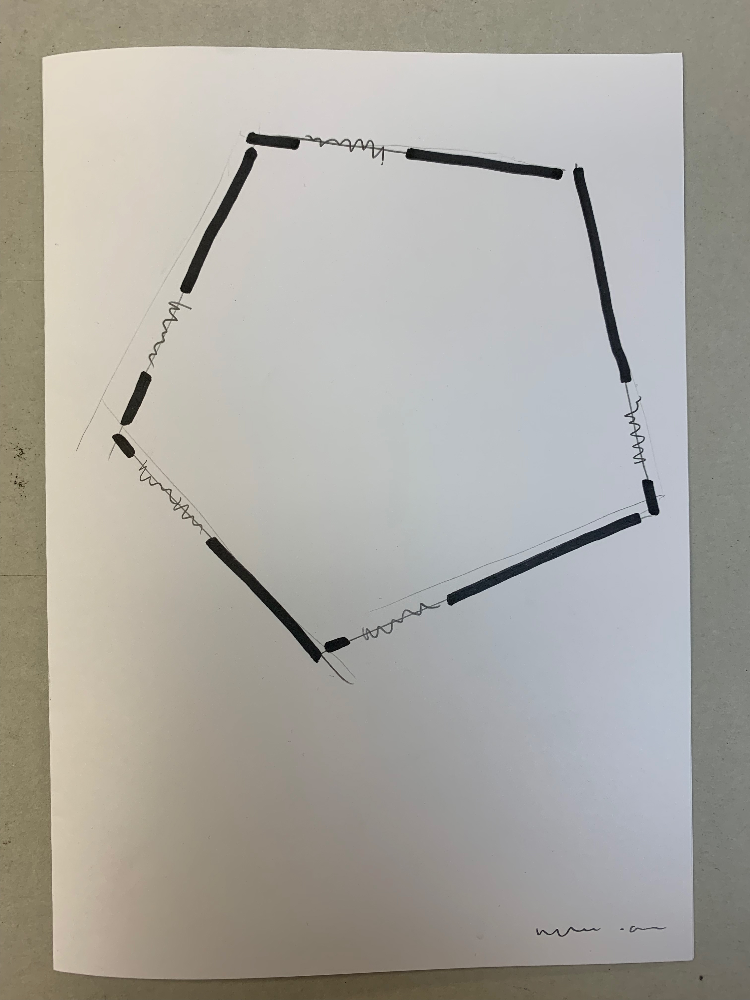
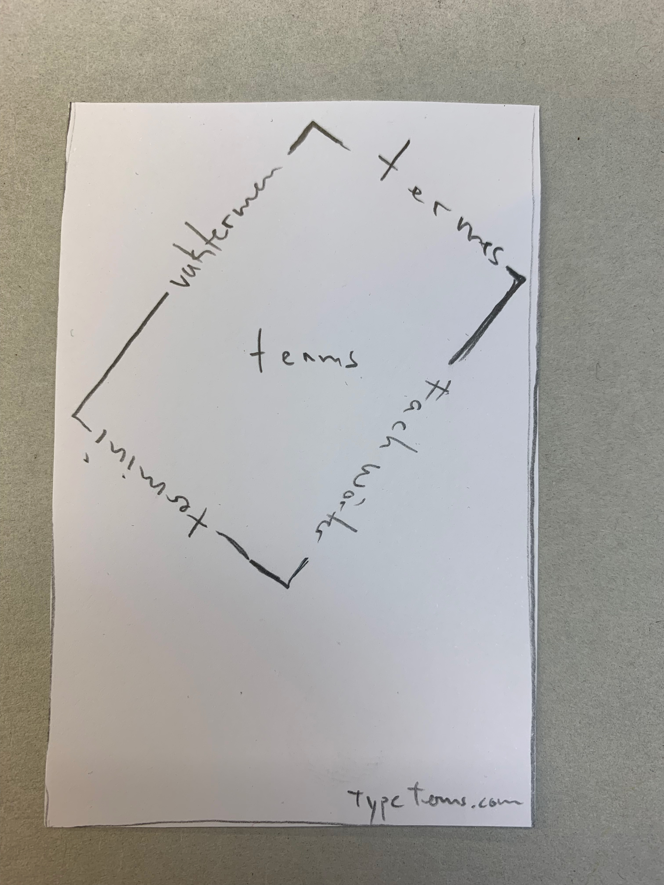
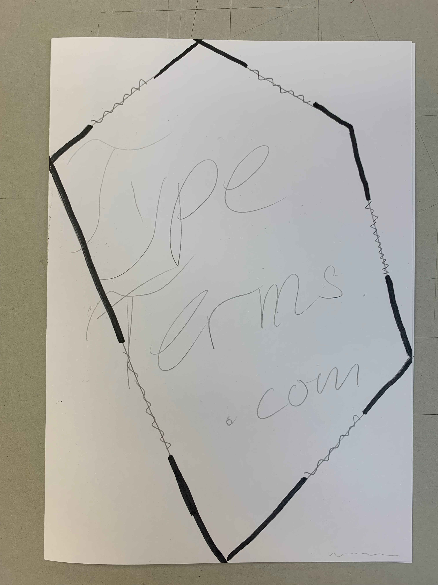
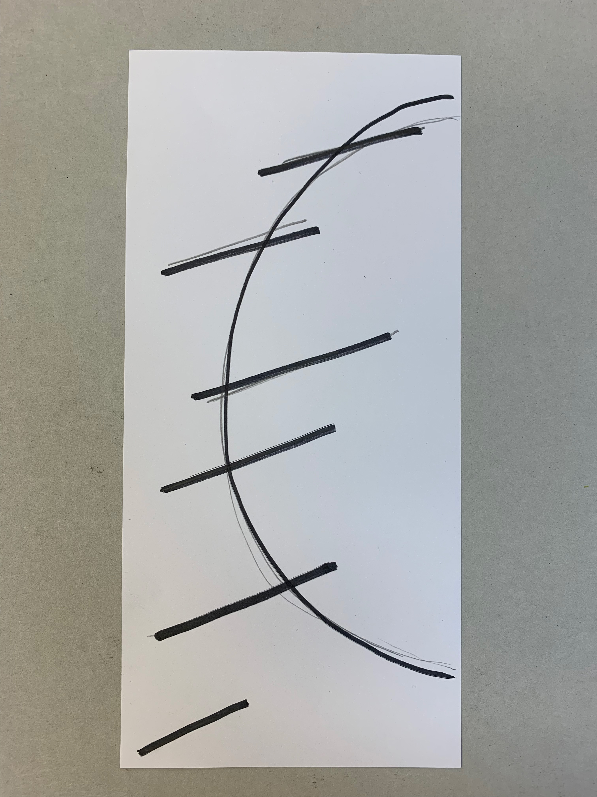
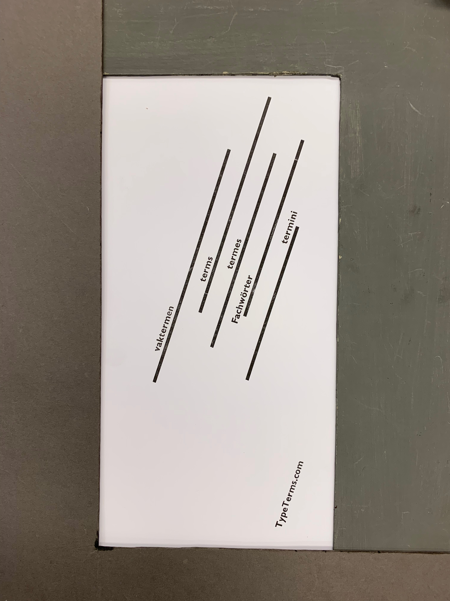
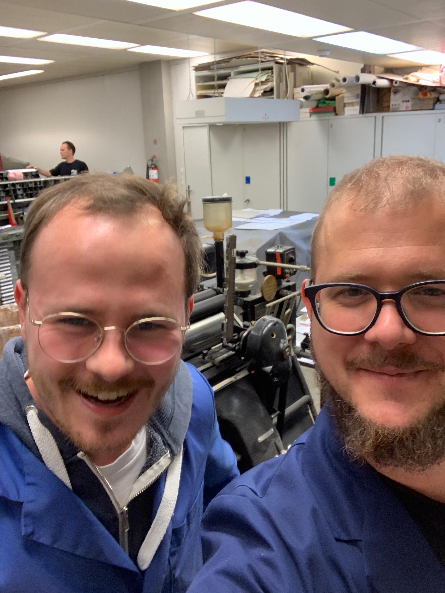

import Gallery from 'gatsby-theme-signalwerk/src/components/Gallery';

## Entwürfe

Nun hatten wir uns auf einenen [Domain-Namen](../typeterms-naming/) geinigt, auf dem die Online-Plattform rund um «the printer's terms» publiziert werden soll. Eine kleine Karte für die Ankündigung der Website muss also her!

[Rudolf Barmettler](https://www.zhdk.ch/person/10417), der die Bleisatz-Werkstatt der [Schule für Gestatlung Zürich](https://sfgz.ch/) leitet, war so freundlich, uns einen Abend gemeinsam in der Werkstatt arbeiten zu lassen. Zudem ist er uns mit Rat zur Seite gesprungen. Die ersten zwei Stunden des Abends hatten wir Ideen und Konzepte zusammengetragen.

<Gallery>

</Gallery>

## Selektion
Danach einigten wir uns auf einen Entwurf.

## Maquette
Aus einer gewachsten Schriftproben und schwarzen Blättern – für die Linien – klebten wir eine Maquette. Also ein geklebter Enwurf, der dem Stand und der Gestaltung des fertigen Produkts schon sehr glich.

## Endproduckt
Noch nicht geschnitten, aber fertig gedruckt liegen die Karten nun im Rack zum trocknen und nächste Woche können wir diese holen.

## Teamwork
Wir waren zwar erst mitten in der Nacht zuhause, aber dennoch war es ein toller Abend, an dem wir in nur wenigen Stunden den Text, die Gestaltung und die Produktion besorgen konnten.

